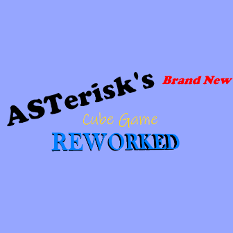

## ASTerisk's Brand New Cube Game REWORKED!

Basically GD, but remastered as a cool platformer game! (HEAVY WIP)

- Interface with Discord-ish colors and new sounds
- New levels (Story ones and infinity run)
- New game modes: Endless mode (OH MY GOD A BALDI'S BASICS REFERENCE!!!!), Story mode
- You now play as ASTerisk, the creator of this mod, instead of some kind of a random guy.

\- user95401, creator of Umbral Abyss and his other mods



# Developing

## Getting started
We recommend heading over to [the getting started section on our docs](https://docs.geode-sdk.org/getting-started/) for useful info on what to do next.

## Build instructions
For more info, see [our docs](https://docs.geode-sdk.org/getting-started/create-mod#build)
```sh
# Assuming you have the Geode CLI set up already
geode build
```

## Resources
* [Geode SDK Documentation](https://docs.geode-sdk.org/)
* [Geode SDK Source Code](https://github.com/geode-sdk/geode/)
* [Geode CLI](https://github.com/geode-sdk/cli)
* [Bindings](https://github.com/geode-sdk/bindings/)
* [Dev Tools](https://github.com/geode-sdk/DevTools)
